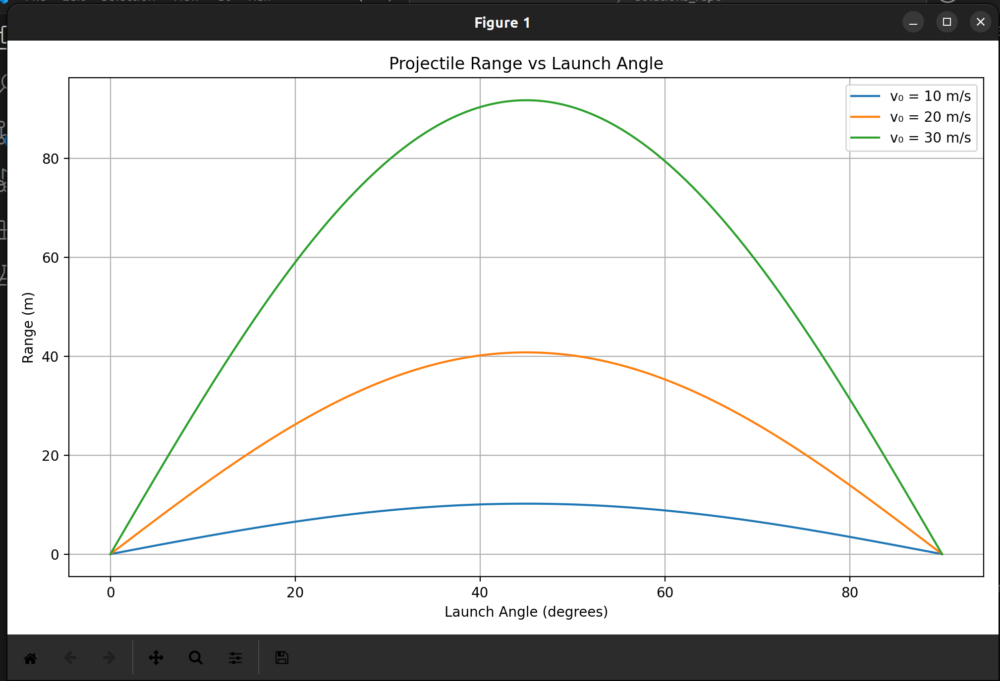

```
import numpy as np
import matplotlib.pyplot as plt


g = 9.81  # gravitational acceleration (m/s^2)

def calculate_range(v0, theta_deg, h0=0):
    """
    Calculate the range of a projectile launched at angle theta_deg
    with initial speed v0 and initial height h0.
    """
    theta = np.radians(theta_deg)
    if h0 == 0:
        # Simplified range formula when launch height is 0
        R = (v0**2 * np.sin(2 * theta)) / g
    else:
        # Generalized formula considering launch height h0
        R = (v0 * np.cos(theta)) * (
            v0 * np.sin(theta) + np.sqrt((v0 * np.sin(theta))**2 + 2 * g * h0)
        ) / g
    return R

v0_values = [10, 20, 30]  # different initial velocities
angles = np.linspace(0, 90, 500)


plt.figure(figsize=(10, 6))
for v0 in v0_values:
    ranges = [calculate_range(v0, angle) for angle in angles]
    plt.plot(angles, ranges, label=f'v₀ = {v0} m/s')

plt.title('Projectile Range vs Launch Angle')
plt.xlabel('Launch Angle (degrees)')
plt.ylabel('Range (m)')
plt.legend()
plt.grid(True)
plt.tight_layout()
plt.show()
```


 "a problem1")
